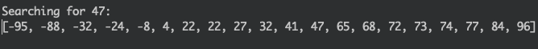
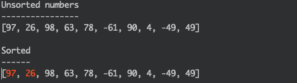
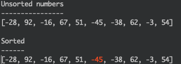

# Sorting and Searching Algorithm Visualization with Python

This project contains command line programs that show various sorting and searching algorithms with Python 3 by using colored text.  
  
## Usage
Run the **setup** file from the root directory:

    pip3 install .

Then each script in the **sorting** and **searching** directories can be run independently.
  
## **Searching**
### Linear Search
  
The current value being compared to is shown in yellow; if it doesn't match then it's turned red, and green once it's found.

  
### Binary Search
  
Two pointers to the first and last elements are shown in blue, and the middle value being tested in yellow. If it doesn't match, one of the pointers is adjusted and the eliminated values are turned red. If the value is found it turns green.

  
## **Sorting**
### Bubble Sort
  
The two values being compared are shown in red. If they need to be swapped then they are shown in yellow and blue so the swap can been seen more easily. Each value if turned green as it "bubbles" up.

  
### Selection Sort

 
The unsorted sublist is shown in white and the sorted sublist in green. First the minimum value of the unsorted sublist is found and highlighted in red, then swapped to the end of the sorted sublist.